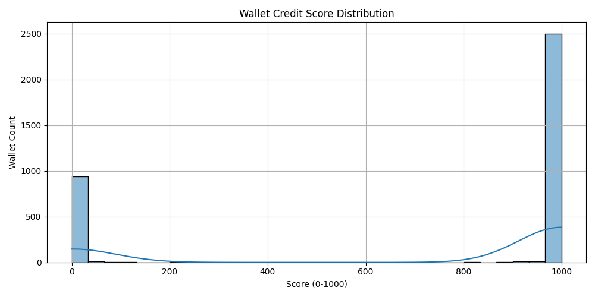

# 📊 Credit Score Analysis of Aave V2 Wallets

This analysis presents insights into credit scores assigned to Ethereum wallets based on Aave V2 transaction history. Scores are ML-derived and range from 0 to 1000, with higher scores indicating more responsible, DeFi-native behavior.

---

## 🔢 Score Distribution

We bucketed the scores into bands of 100 to examine distribution across ranges:

| Score Range | Wallet Count |
|-------------|--------------|
| 0–100       | 119          |
| 101–200     | 5            |
| 201–300     | 1            |
| 301–400     | 1            |
| 401–500     | 1            |
| 501–600     | 1            |
| 601–700     | 0            |
| 701–800     | 2            |
| 801–900     | 6            |
| 901–1000    | 2518         |

📈 Score Distribution Histogram:  

---

## 🔻 Behavior of Low-Scoring Wallets (0–300)

Low-score wallets (n = 968) exhibit the following characteristics:

- **Extremely low average score**: 4.02  
- **Median score**: 0.0 (75% of wallets have a score of 0)
- **Standard deviation**: 17.45 — very tight around zero
- **Label**: 100% are labeled as **risky** (label = 0)

📌 These wallets likely:
- Performed no repayments
- Were involved in liquidations or high-leverage behaviors
- Show bot-like or one-off transactional patterns
- May represent exploiters, abandoned wallets, or test interactions

---

## 🟢 Behavior of High-Scoring Wallets (700–1000)

High-score wallets (n = 2526) show:

- **Average score**: 998.57  
- **Minimum score**: 760  
- **Median & 75th percentile**: 1000  
- **Label**: 100% are labeled as **reliable** (label = 1)

📌 These wallets typically:
- Repaid loans consistently and fully
- Avoided liquidation events
- Used the protocol responsibly over time
- Likely participated in legitimate borrowing/lending strategies

---

## 📈 Feature Behavior

Also see:
- 📊 `feature_boxplot.png` – Distribution of repay ratio, borrow/deposit, and liquidation rate
- 📦 `wallet_scores_ml.csv` – Complete score and label data per wallet

---

## 🔬 Observations

- Over **96%** of wallets fall into either very low (0–100) or very high (901–1000) bands, indicating highly polarized behavior
- Middle score bands (200–800) are nearly empty — the model is highly confident in separating risky from safe users
- Most high scorers are ideal protocol participants; most low scorers may be safely excluded or flagged

---

## 🧠 Use Cases

- Assign borrowing limits, interest rates, or incentive tiers
- Detect and filter out Sybil or farming wallets
- Enable undercollateralized lending based on score

---

## 🔮 Future Improvements

- Calibrate scores with real on-chain liquidation/default outcomes
- Add unsupervised anomaly detection for edge behaviors
- Integrate time-based features (e.g. velocity of behavior change)
- Expand coverage to Aave V3, Compound, Morpho, or across chains

---
